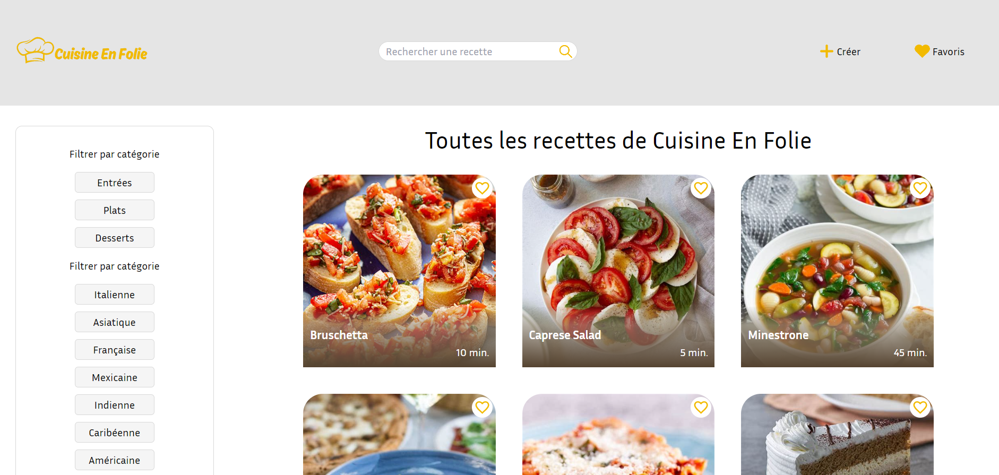

# Application de recettes de cuisine


Application de recettes de cuisine en ReactJS pour l'interface utilisateur, TypeScript pour la gestion des types et états.
Maquette réalisée sur Figma, design et mise en page avec css et TailwindCSS.

[Visiter le site](https://cuisineenfolie-prod.vercel.app/)

## Instructions d'installation du projet

- Vérifier que vous aillez une version à jour de node.js (version 20)
- Cloner le dépôt GitHub  

```git
git clone https://github.com/AnaisP974/cuisineenfolie-prod.git
```

- Installer les dépendances avec:

```git
npm installe
```

- Lancer tailwindCSS:

```git
npm run tailwind
```

- Lancer l'application en mode développement:

```git
npm run start
```

## Organisation du projet et des composants

## Architecture du projet  

## Explication des choix techniques  

## Déroulement  

- Jour1: Organisation, maquette, réflexion, initialisation du projet, création de la BDD
- Jour2: Création des composants Header, Footer, App, Aside et RecipeDetail. Affichage des pages Home et Detail.
- Jour3  
👍Affichage des boutons "filterBtns" de façon dynamique
👍Au click sur les boutons "filterBtns" afficher le RecipeList et aller sur la route "/filter/:slug"
👍Afficher le btn "Vider le filtre" uniquement si une catégorie est sélectionnée
👍Ajouter du style sur le bouton de la catégorie choisie
👍Input de recherche -> Créer un évènement au click qui permet de récupérer le mot saisie et filtrer la bdd pour afficher les recettes trouvées
