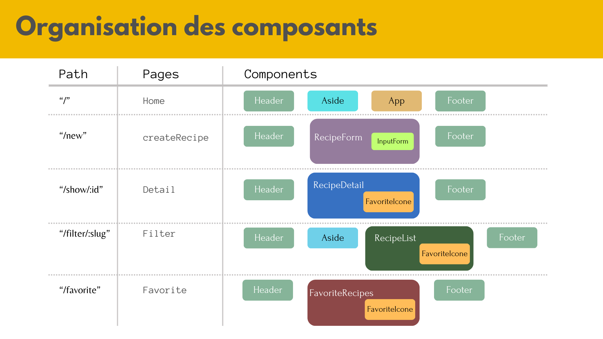
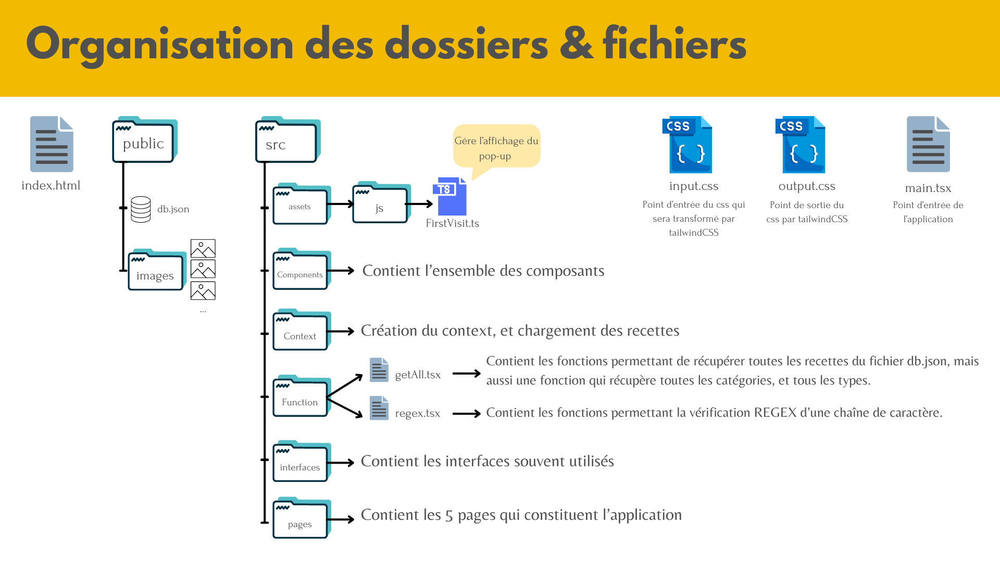

# Application de recettes de cuisine

  
Application de recettes de cuisine en ReactJS pour l'interface utilisateur, TypeScript pour la gestion des types et états.
Maquette réalisée sur Figma, design et mise en page avec css et TailwindCSS.

[Visiter le site](https://cuisineenfolie-prod.vercel.app/)

## Instructions d'installation du projet

- Vérifier que vous aillez une version à jour de node.js (version 20)  

```git
node -v
```  

- Cloner le dépôt GitHub  

```git
git clone https://github.com/AnaisP974/cuisineenfolie-prod.git
```

- Installer les dépendances avec:

```git
npm install
```

- Lancer tailwindCSS:

```git
npm run tailwind
```

- Lancer l'application en mode développement:

```git
npm run start
```

## Fonctionnalités et composants

1. Affichage des recettes  

    Liste des Recettes :  
    - Affichage des recettes sous forme de cartes avec un aperçu rapide (image, titre, temps de préparation).  
    - Possibilité de filtrer les recettes par catégorie et par types.  
    Détails de la Recette :  
    - Page détaillée affichant le titre, l'image, la liste d'ingrédients et les étapes de préparation.  
    - Informations additionnelles comme le temps de préparation, le nombre de portions et des conseils de cuisine.  

2. Recherche de recettes  

    Barre de recherche avec suggestions automatiques  
    - Affichage des suggestions basées sur les caractères saisis.  
    - Recherche en temps réel dans une base de données de recettes.  

3. Favoris  

    - Bouton permettant d'ajouter ou de retirer une recette des favoris.  
    - Stockage des recettes favorites dans le local storage pour persister entre les sessions.  
    - Page dédiée affichant toutes les recettes marquées comme favorites.  

4. Ajout de Recettes  

    Formulaire de Soumission  
    - Formulaire permettant d’ajouter une nouvelle recette avec des champs pour le titre, la description, les ingrédients, les étapes de préparation, la catégorie et une image.
    - Validation des champs pour s'assurer que toutes les informations nécessaires sont fournies.

5. Suppression de Recettes  

    - Affichage du bouton de suppression que s'il s'agit d'une recette ajoutée par l'utilisateur.
    - Vérifié si la recette supprimée fait partie des favoris de l'utilisateur.

  

  
